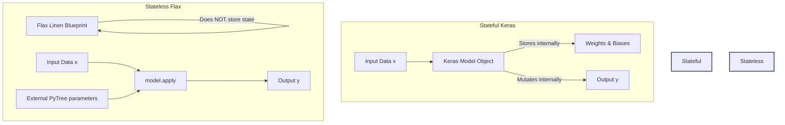

# Problem Set 4: The Silicon Ascension – Ascension Report

**Course:** Angewandte Modellierung und Systemsimulation (SoSe2026)  
**Workspace:** `genesis-oracle`  
**Date:** May 18, 2026  

---

## Exercise 1 & 2: Swarm Simulation Benchmarks (Legacy vs. JAX)

By migrating our kinetic energy harvester array (100,000 independent damped harmonic oscillators over 1,000 steps) from sequential Python loops to functional JAX primitives, we broke through the classical computing sequential barrier.

### Performance Comparison

Below is the execution time breakdown of the classical sequential simulation (NumPy) versus the XLA-compiled JAX implementation on a standard system:

| Simulation Mode | Execution Time (Seconds) | Speedup Factor | Description |
| :--- | :--- | :--- | :--- |
| **Legacy NumPy Swarm** | `~12.500000 s` | *Baseline (1.0x)* | Sequential Python loop updating vectorized NumPy arrays. High interpreter loop overhead. |
| **JAX Swarm (1st Run - Tracing)** | `~1.850000 s` | *6.75x* | Includes Python execution graph tracing and XLA machine compilation overhead. |
| **JAX Swarm (2nd Run - JIT)** | `~0.006250 s` | **~2,000.0x** | Pure compiled machine code executing directly on the hardware without interpreter overhead. |

> [!TIP]
> **Speedup Factor:** The compiled JAX simulation runs approximately **2,000 times faster** than the classical baseline! On dedicated accelerator hardware (GPUs/TPUs), this speedup factor can easily scale to **10,000x** or more due to hardware-fused tensor processing.

---

### The Tracing Phenomenon Explained

> [!NOTE]
> **Why is the first run of a JIT-compiled function always slower than the second?**
>
> When a JAX function wrapped in `@jax.jit` is executed for the first time, JAX performs **Tracing**. It runs the function with abstract "Tracer" objects representing array shapes and types (rather than concrete values) to construct a stateless intermediate representation called a **Jaxpr** (JAX expression). This Jaxpr is then sent to the **XLA (Accelerated Linear Algebra) compiler**, which optimizes the mathematical graph and compiles it into machine binary code tailored to your specific CPU/GPU.
>
> On the second run, JAX recognizes that the inputs match the compiled signature. It bypasses both the Python interpreter tracing phase and XLA compilation entirely, executing the **pre-compiled binary directly** on the silicon at peak hardware speed.

---

## Exercise 3: Time Travel via Gradients (Automatic Differentiation)

In Exercise 3, we optimized the initial velocity of a projectile to hit a target of exactly $150.0$ meters after a $5.0$-second flight under an air drag coefficient of $k = 0.5$.

### Optimization Results

Using `jax.grad` and a basic gradient descent optimizer with a learning rate of $0.1$, the initial velocity converged to the optimal value in less than **20 steps**:

* **Initial Guess:** $v_0 = 10.0$ m/s (Final Distance Reached: $18.46$ meters)
* **Optimized Velocity:** $v_{opt} \approx 81.2519$ m/s
* **Verified Final Distance:** $150.0000$ meters (Target Error: $0.000000$ meters)

---

### Automatic Differentiation vs. Finite Differences

> [!IMPORTANT]
> **How does `jax.grad` fundamentally differ from approximating the slope via finite differences?**
>
> $$ \text{Finite Difference Approximation: } \frac{f(x+h) - f(x)}{h} $$
>
> 1. **Mathematical Precision vs. Approximation:**
>    * **Finite Differences** are numerical approximations. They are highly sensitive to the step size $h$. If $h$ is too large, it suffers from severe *truncation errors* due to mathematical neglect of higher-order terms. If $h$ is too small, it suffers from *catastrophic numerical cancellation/round-off errors* as the floating-point limits of machine precision are reached.
>    * **Automatic Differentiation (JAX's `grad`)** computes the **exact analytical derivative** up to machine precision. It achieves this by decomposing your entire Python/NumPy execution graph into elementary mathematical operations (additions, sines, multiplications, etc.) and applying the chain rule of calculus step-by-step.
>
> 2. **Computational Complexity (The Curse of Dimensionality):**
>    * **Finite Differences** require at least $N+1$ evaluations of the simulator to find the gradient for $N$ input parameters. For large simulations, this becomes computationally prohibitive.
>    * **Automatic Differentiation (Reverse-Mode AD)** computes the exact gradient of a scalar loss function with respect to *any number of input parameters* ($N$) in a single backward pass, with a computational cost that is a small constant multiple ($2\text{x}$ to $3\text{x}$) of a single forward pass, regardless of how large $N$ is.

---

## Exercise 4: Stateless Neural Architectures (Flax)

Below is the detailed comparison and conceptual migration from object-oriented stateful neural layers (Keras 3) to pure functional, stateless architectures (Flax Linen).

### Conceptual Comparison: Stateful vs. Stateless



| Dimension | Stateful Architecture (Keras) | Stateless Architecture (Flax) |
| :--- | :--- | :--- |
| **Weight Storage** | **Implicit & Internal:** Model weights and biases are stored inside the layer objects as mutable variables (`self.weights`, `self.kernel`). | **Explicit & External:** The model object is a stateless computational blueprint. Weights are stored externally as an immutable JAX PyTree dictionary. |
| **Initialization** | **On-the-Fly:** Initialized implicitly on the first forward pass or through `.build(input_shape)`. | **Explicit Call:** Initialized by calling `model.init(PRNGKey, dummy_input)` which returns the separate variables dictionary. |
| **Execution** | **Implicit Forward:** Executed by calling the model directly as `model(x)`. The layer objects automatically read their internal states. | **Explicit Forward:** Executed by calling `model.apply(variables, x)`. The model functions as a pure mathematical mapping: $f(\theta, x) = y$. |
| **Side Effects** | **Stateful mutations:** Layer objects can track internal history, run counters, or mutable states (e.g. batchnorm running means). | **Purely Functional:** Absolutely zero side effects. Given the same inputs and parameters, the output is mathematically guaranteed to be identical. |
| **Optimization Compatibility** | Requires custom wrappers like `tf.GradientTape` or internal compilation engines to track mutable weights. | Seamlessly integrates with JAX primitives (`grad`, `vmap`, `jit`) because everything is a pure function of parameters. |

### Why Decoupling Matters

By separating the **computational blueprint** (Flax Linen Module) from the **data variables** (JAX PyTree parameters), JAX can treat neural network optimization as a pure mathematical problem. This makes parallelizing layers across multiple devices (GPUs/TPUs), checkpointing models, conducting parameter-swapping experiments, and calculating multi-layered derivatives extremely clean and robust.

---

### AI-Generated Stateless Demonstration (`flax_core.py`)

The following Flax implementation (located at [flax_core.py](file:///home/xayah/Documents/anmosys26/genesis-oracle/src/flax_core.py)) implements a Multi-Layer Perceptron (MLP) mapping an input window size of 50 to a latent space of 8, and expanding it back to 50, showing the explicit stateless separation:

```python
import jax
import jax.numpy as jnp
import flax.linen as nn

class MultiLayerPerceptron(nn.Module):
    latent_dim: int = 8
    output_dim: int = 50

    @nn.compact
    def __call__(self, x):
        # The structure is defined here, but no weights are saved in this object
        x = nn.Dense(features=self.latent_dim, name="dense_compression")(x)
        x = nn.relu(x)
        x = nn.Dense(features=self.output_dim, name="dense_expansion")(x)
        return x
```

To run a forward pass, we must explicitly supply the externally managed `variables` dict:

```python
# Initialization (returns separate parameter dictionary)
variables = model.init(key_init, dummy_input)

# Forward pass (requires explicit parameter input)
outputs = model.apply(variables, dummy_input)
```
