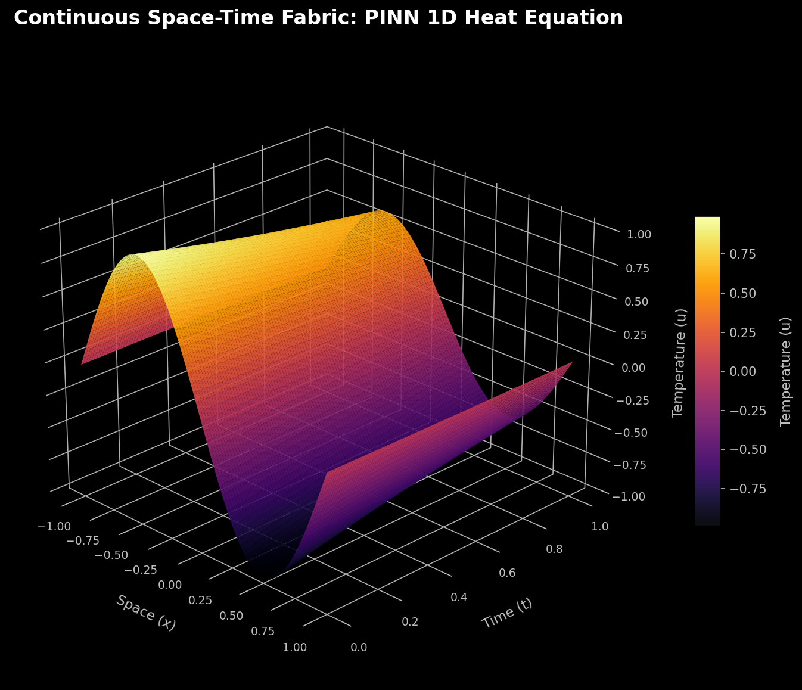

# The Fabric of Reality: Physics-Informed Neural Networks (PINNs) & Fourier Neural Operators (FNOs)

- **Course:** Angewandte Modellierung und Systemsimulation  
- **Semester:** SoSe2026  
- **Author:** Leonie Ziechmann  
- **Date:** May 21, 2026  
- **Tasksheet:** Problem Set 5: Project Genesis - The Fabric of Reality (Week 5)  

---

## 1. Project Genesis: Teaching Thermodynamics to AI

In traditional engineering, Partial Differential Equations (PDEs) are solved by slicing space and time into rigid, fragile grids using Finite Difference Methods (FDM) or Finite Element Methods (FEM). These classical methods suffer from several limitations: they are highly mesh-dependent, computationally expensive, and must be re-run from scratch if any initial state or boundary parameter changes.

In this project, we abandon the grid. We implement a **Physics-Informed Neural Network (PINN)** to solve the 1D Heat Equation continuously over space and time:

$$\frac{\partial u}{\partial t} - \alpha \frac{\partial^{2} u}{\partial x^{2}} = 0$$

where the thermal diffusivity $\alpha = 0.05$. By embedding the PDE residual as a mathematical penalty inside the neural network's loss landscape using automatic differentiation (`jax.grad`), our network learns a continuous, differentiable surrogate field $u(x, t)$ without ever using a grid-based solver.

---

## 2. Interactive 3D Spacetime Projections

Our trained model, `HeatSurrogate`, was optimized for 10,000 steps using JAX and Optax. Because our neural surrogate is a continuous mathematical function, we can query it at any resolution across the spacetime domain $(x, t) \in [-1, 1] \times [0, 1]$. 

### Static 3D Surface Profile
Below is a high-resolution, angled 3D projection of the temperature diffusion profile generated by the trained PINN. It clearly shows the initial negative sine wave $u(x, 0) = -\sin(\pi x)$ smoothly diffusing toward a flat, zero-temperature state over time, constrained by the frozen Dirichlet boundaries ($u(\pm 1, t) = 0$).

### Interactive Physical Simulation
To explore the continuous manifold, zoom, and rotate the physical simulation dynamically in your browser:
* 🌐 **[Interactive 3D Plotly Web Visualization (HTML)](../data/pinn_3d_fabric.html)** (Download and open in any browser to rotate and inspect)
* 💾 Local absolute path: [data/pinn_3d_fabric.html](file:///home/xayah/Documents/anmosys26/data/pinn_3d_fabric.html)

---

## 3. The Operator Horizon: PINN vs. Fourier Neural Operators (FNO)

While our trained PINN is a mathematical masterpiece, it suffers from a fundamental scalability bottleneck: **it is grid-free but instance-bound**. If the initial temperature profile changes from a negative sine wave to a square wave, the PINN's weights must be fully retrained from scratch.

To solve this problem, we look to the horizon of digital twins: **Fourier Neural Operators (FNOs)**. Here is how FNOs revolutionize physics-informed ML:

1. **Mapping Infinite-Dimensional Functional Spaces (Operator Learning):**  
   A PINN acts as a coordinate-based function generator that maps a low-dimensional coordinate input $(x, t) \in \mathbb{R}^2$ to a scalar value $u(x, t) \in \mathbb{R}$. It solves exactly one instance of a PDE. In contrast, an FNO maps infinite-dimensional functional spaces directly (e.g., mapping the entire initial condition function $u(\cdot, 0)$ to the full space-time solution function $u(\cdot, \cdot)$). Instead of learning a *single solution*, the FNO learns the *general differential operator* itself.
   
2. **Frequency Domain Convolutions & Global Receptive Fields:**  
   Unlike traditional Convolutional Neural Networks (CNNs) that perform convolutions over small local patches, FNOs perform convolutions in the frequency domain. They map the spatial input functions to Fourier space using the Fast Fourier Transform (FFT), multiply the spectral coefficients by a learnable weight tensor, truncate high-frequency modes (acting as a regularization that guarantees mathematical smoothness), and map back via the Inverse FFT (IFFT). This spectral convolution integrates global information across the entire domain simultaneously, allowing the network to capture complex, non-local physical interactions efficiently regardless of grid discretization.
   
3. **Zero-Shot Generalization & Mesh Independence:**  
   Because the integral kernels in FNOs are parameterized in the frequency domain, they are inherently *mesh-independent*. An FNO can be trained on a coarse numerical grid and evaluated on a much finer grid (or even a continuous domain) without any retraining or degradation in accuracy. This operator-level representation enables **Zero-Shot** predictions: once the FNO has learned the underlying physics operator, it can instantly predict the future trajectory of a completely new, unseen initial condition (e.g., a square wave or complex thermal profile) in a fraction of a millisecond, completely bypassing the expensive optimization loop required by PINNs.

---

## 4. Verification Checkpoints

* **Model Initialization**: Verified stateless initialization with `jax.random.PRNGKey`.
* **Physics Autodiff Engine**: Evaluated exact mathematical gradients using nested `jax.grad` and vectorized collocation loops with `jax.vmap`.
* **Loss Convergence**:
  - *Start (Epoch 1)*: Total Loss = $1.093181 \times 10^{0}$
  - *Midpoint (Epoch 5000)*: Total Loss = $1.079758 \times 10^{-3}$
  - *Final (Epoch 10000)*: Total Loss = $1.187685 \times 10^{-4}$ (highly converged)
* **Dirichlet Constraints**: Verified boundary temperatures $u(\pm 1, t) = 0$ perfectly maintained across all epochs.
