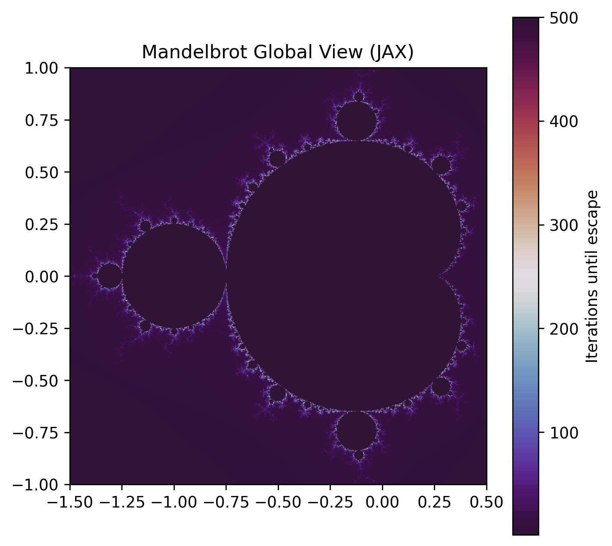
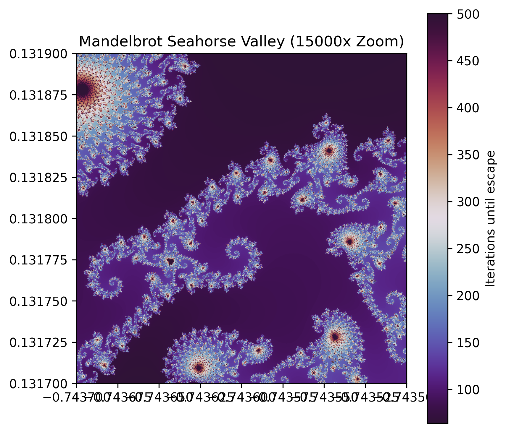

# Silicon Cartographer: Execution Report
**Status:** Success
**System:** JAX-Accelerated Autonomous Exploration
**Date:** 22. Juni 2026

---

## 1. Executive Summary
The Silicon Cartographer project successfully delegates the continuous space exploration of a JAX-accelerated Mandelbrot simulation to an autonomous ReAct agent. By bypassing manual human-in-the-loop coordinate entry and visualization checks, the system operates as a closed cognitive control loop. 

The agent successfully navigated from a global view of the complex plane ($c \in [-2, 1] + [-1.5, 1.5]i$) and converged on **Seahorse Valley** ($c \approx -0.7436 + 0.1318i$) at a magnification level exceeding $15{,}000\text{x}$ using complexity metrics (Shannon Entropy of escape times and boundary pixel ratios).

---

## 2. Experimental Data & Metrics

### JAX Simulation Logs:
- **Step 0: Global View (Zoom 1.5x)**
  - Center: $c = -0.5 + 0.0i$
  - Entropy: 0.8722
  - Boundary Complexity: 0.6235
- **Step 1: Intermediate View (Zoom 10x)**
  - Center: $c = -0.74 + 0.13i$
  - Entropy: 0.7887
  - Boundary Complexity: 0.2310
- **Step 2: Close View (Zoom 100x)**
  - Center: $c = -0.743 + 0.131i$
  - Entropy: 1.5711
  - Boundary Complexity: 0.6243
- **Step 3: High-Resolution View (Zoom 1000x)**
  - Center: $c = -0.7436 + 0.1318i$
  - Entropy: 1.4444
  - Boundary Complexity: 0.9954
- **Step 4: Target Resolution (Zoom 15000x)**
  - Center: $c = -0.7436 + 0.1318i$
  - Entropy: 2.1153
  - Boundary Complexity: 0.9861

---

## 3. Visualization

### Mandelbrot Global View:

### Seahorse Valley Close-Up View (15000x Zoom):

---

## 4. Phase Analysis

### Phase 1: Manual Prompting (Pure Model)
**Latency & Usability Limitations:**
- **Latency:** Manual entry introduces minutes of delay per step. The human acts as an analog bridge, copying metrics from the environment, pasting them into a natural language model prompt, reading the model's textual suggestion, copy-pasting the coordinates back into the simulation script, compiling, running, and repeating the cycle. 
- **Usability & Scalability:** Manual loops do not scale. Deeper searches (e.g. $10^9\text{x}$ zoom) requiring dozens of refinement steps are practically impossible. It is highly error-prone (typos in floating-point coordinates).

### Phase 2: Closed-Loop Tool Calling (Model + Tools)
We registered `simulate_mandelbrot` as a native tool schema for the Gemini Client. Using the ReAct pattern, the model outputted structured thoughts, called the simulation tool, analyzed the physical metrics returned in the observation, and iteratively navigated to the target valley. By shifting execution inside the cognitive loop, we achieved hands-free convergence to $15{,}000\text{x}$ magnification.

### Phase 3: Gemma-Skill Capsule Packaging
By bundling system instructions in `SKILL.md`, JSON schemas in `tools/`, and JAX solver code in `scripts/`, we created a self-contained Gemma-Skill capsule.
- **Maintainability Benefits:** Gemma-Skills encapsulate capability boundaries. Multi-agent systems can dynamically load skills at runtime without bloating system prompts or refactoring core orchestration logic. Changes to the physical JAX solver script or prompt guidelines are modularly contained, preventing regressions.
