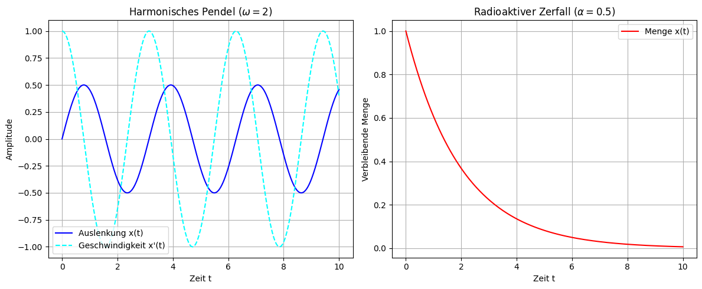
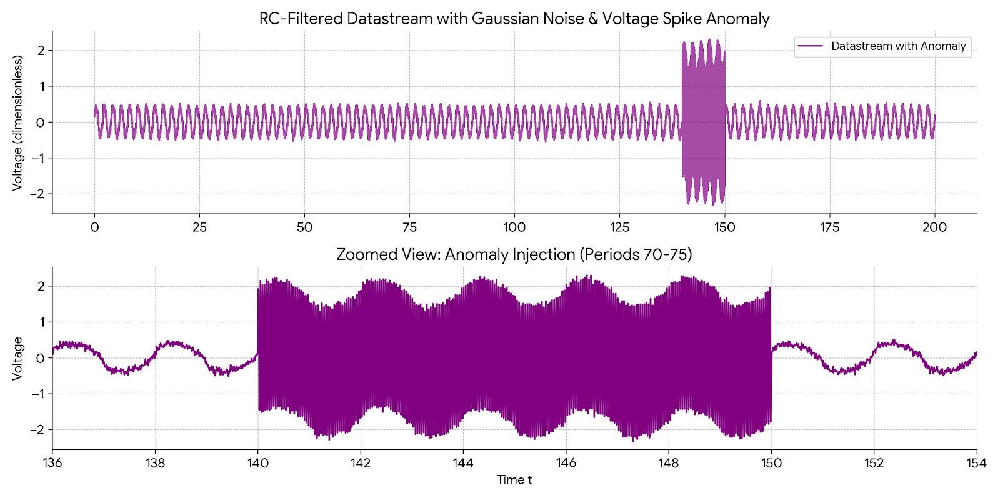
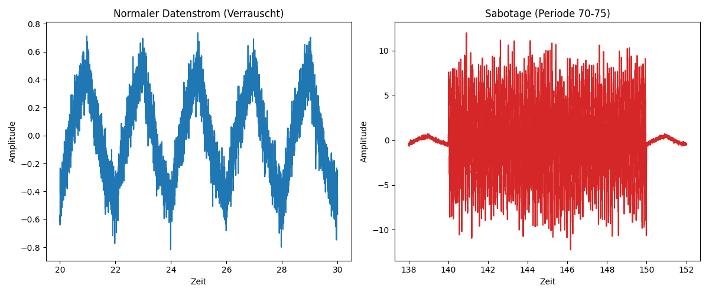
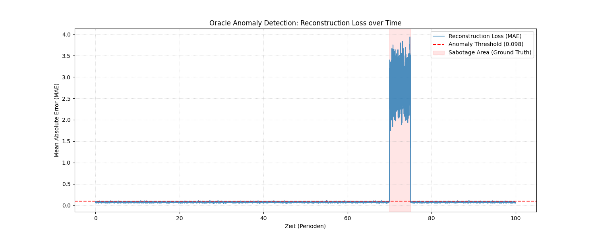

# Abgabedokument
- **Modul:** Angewandte Modellierung und Systemsimulation
- **Semester:** SoSe2026
- **Name:** Leonie Ziechmann
- **Matrikelnummer:** XXXXXXX

---

# Problem Set 1: Project Genesis - The Agentic Awakening
**Datum:** 13. April 2026

## Exercise 1: Forging the Digital Sanctum (Environment & Terminal Automation)

**1. Verwendeter Gemini-Prompt zur Skripterstellung:**
> "Write a bash script that creates a modern Python project structure with directories src/, data/, agents/, and docs/. Inside src/, create an empty main.py. Output only the executable bash code."

**2. Generiertes Bash-Skript (`init_nexus.sh`):**
```bash
#!/bin/bash
mkdir -p src data agents docs
touch src/main.py
```

**3. Terminal-Ausführung und Verzeichnisstruktur:**
```text
leonix@wsl:~/workspace$ chmod +x init_nexus.sh
leonix@wsl:~/workspace$ ./init_nexus.sh
leonix@wsl:~/workspace$ tree
./
├── agents
├── data
├── docs
├── init_nexus.sh
└── src
    └── main.py

4 directories, 2 files
```

---

## Exercise 2: Echoes of Electronica (Continuous Systems & Dimensionless Variables)

### 1. Manuelle Herleitung der dimensionslosen Form
Die ursprüngliche Gleichung für das harmonisch schwingende Pendel ist: $\ddot{x} + \omega^2 x = 0$.

Mit der neuen Zeitvariablen $\tau = \omega t$ ergibt sich nach der Kettenregel:
1. **Erste Ableitung:** $\frac{dx}{dt} = \frac{dx}{d\tau} \frac{d\tau}{dt} = \omega \frac{dx}{d\tau}$
2. **Zweite Ableitung:** $\frac{d^2x}{dt^2} = \frac{d}{dt} \left(\omega \frac{dx}{d\tau}\right) = \omega^2 \frac{d^2x}{d\tau^2}$

Durch Einsetzen in die Originalgleichung erhalten wir:
$$\omega^2 \frac{d^2x}{d\tau^2} + \omega^2 x = 0$$

Nach Division durch $\omega^2$ (da $\omega > 0$) ergibt sich die finale dimensionslose Form:
$$\frac{d^2x}{d\tau^2} + x = 0$$

### 2. Antwort zur Machine-Learning-Frage (JAX/Flax)
Die Transformation physikalischer Zustände in dimensionslose Variablen ist beim Training von Neuronalen Netzen eine entscheidende Fähigkeit, da Modelle stark von der Skalierung der Eingabedaten abhängen. Dimensionslose Variablen normalisieren die Zustände des Systems natürlicherweise, was numerische Instabilitäten (wie explodierende oder verschwindende Gradienten) während des Trainings verhindert. Zudem ermöglicht es dem Modell, Gesetzmäßigkeiten über physikalische Systeme völlig unterschiedlicher Größenordnungen hinweg zu generalisieren.

### 3. Verwendeter Prompt für das Pair-Programming
> "Write a highly documented Python script located at src/ancients.py. Use scipy.integrate.solve_ivp to solve two continuous differential equations: a swinging pendulum ($\ddot{x} + \omega^2 x = 0$, $x(0)=0$, $\dot{x}(0)=1$, $\omega=2$) and radioactive decay ($\dot{x} = -\alpha x$, $x(0)=1$, $\alpha=0.5$). Plot the results side-by-side using matplotlib for the time interval $t \in [0,10]$ and save the figure."

### 4. Ergebnis-Plot

*Beschreibung:* Der linke Plot zeigt eine harmonische Oszillation (Sinuswelle), der rechte Plot einen exponentiellen Abfall gegen Null.

---

## Exercise 3: The Pulse of Time (Discrete vs. Continuous)

### 1. Ergebnis-Plot der Sabotage ($\Delta t=11$)


**Erklärung des Modellversagens und Bezug zu Simulationsketten:**
Wenn das diskrete Modell mit dem expliziten Euler-Verfahren durch eine sehr große Schrittweite (z.B. $\Delta t=11$) sabotiert wird, versagt es katastrophal, da die Schrittweite den Stabilitätsbereich der zugrundeliegenden Differenzialgleichung weit überschreitet. Im Kontext der Vorlesung bedeutet dies, dass der lokale Fehler exponentiell akkumuliert wird ("Instabilität"), was die gesamte Kette in die numerische Divergenz treibt.

---

## Exercise 4: Igniting the Spark of Autonomy (Enter ADE Antigravity)

### 1. Generierte `docs/Agent_Report.md`
> **Observer-Prime: Execution Report** > **Status:** Success
>
> The simulation script `src/ancients.py` was executed successfully. The script mathematically modeled two physical continuous systems: a harmoniously swinging pendulum and the radioactive decay of an isotope. I have verified that the resulting plot image was successfully generated and stored in the `data` directory.

### 2. Persönliche Reflexion zur Orchestrierung eines KI-Agenten
Die Orchestrierung eines autonomen KI-Agenten zur Steuerung der Simulationspipeline fühlte sich an wie der Übergang vom Ausführenden zum strategischen Architekten. Anstatt mühsam Blockschaltbilder manuell per Drag-and-Drop zu verbinden, konnte ich mich darauf konzentrieren, Absichten und Parameter auf einer Meta-Ebene zu definieren.

---

# Problem Set 2: Project Genesis – The Blueprint & The Vault (Week 2)
**Datum:** 27. April 2026

## Exercise 1: The Vault of Version Control & Blazing Init (uv & Git)

**1. Verwendeter Prompt für den "Agentic Push":**
> "My remote URL is https://github.com/leonieziechmann/anmosys26. Please write the terminal commands to initialize git, stage all files respecting the .gitignore, create a commit with the message 'Initial Genesis Vault setup', and push it to the main branch."

**2. Live GitHub Pages Link:**
[github.com/leonieziechmann/anmosys26](https://github.com/leonieziechmann/anmosys26)

## Exercise 2: Aligning the Triad (Keras 3 + JAX via uv add)
**Umgebungskonfiguration:**
Die Abhängigkeiten (`keras`, `jax`, `numpy`, `scipy`, `matplotlib`) wurden erfolgreich mit dem Paketmanager `uv` aufgelöst und in der Datei `pyproject.toml` verankert. Das JAX-Backend für Keras 3 wurde im Skript `src/oracle_setup.py` via Umgebungsvariable konfiguriert und lokal verifiziert. Die exakten Abhängigkeiten sind via `uv.lock` deterministisch festgehalten.

## Exercise 3: Synthesis of the Aether (Fourier Series & RC Filters)

**1. Datengenerierung & Sabotage:**
Das Skript `src/data_generator.py` generiert die Fourier-Reihe eines Rechtecksignals über 100 Perioden (unter Nutzung der ersten 9 ungeraden Harmonischen). Danach wird die komplexe Übertragungsfunktion des RC-Tiefpassfilters auf jede Harmonische angewendet. Dem Signal wurde zusätzlich Gaußsches Rauschen hinzugefügt und es wurde durch eine massive hochfrequente Spannungsspitze (Sabotage) zwischen Periode 70 und 75 korrumpiert. Das rohe 1D-Array wird physisch lokal gespeichert (`data/datastream.npy`) und über die `.gitignore` vor einem GitHub-Push geschützt.

**2. Ergebnis-Plot des Datenstroms (`data_feed.png`):**


---

# Problem Set 3: Project Genesis – The Oracle Awakens
**Datum:** 11. Mai 2026

## Exercise 1 & 2: Architecture & Cloud Training

**1. Implementierung des Oracle:**
Das "Oracle" wurde als Deep Autoencoder mittels Keras Subclassing API realisiert. In `src/architecture.py` wurden ein `SignalCompression`-Encoder (Reduktion von 50 auf 8 Dimensionen) und ein `SignalExpansion`-Decoder implementiert. Das Modell wurde auf den "normalen" Daten (vor Periode 60) für 30 Epochen trainiert, um die physikalischen Gesetzmäßigkeiten des RC-Filters ohne Anomalien zu erlernen.

**2. Anomalieerkennung:**
Nach dem Training wurde der gesamte Datensatz rekonstruiert. Der Mean Absolute Error (MAE) dient als Metrik für die Abweichung. Ein Schwellenwert (Anomaly Threshold) wurde basierend auf dem Rekonstruktionsfehler der normalen Daten definiert.

**3. Rekonstruktionsverlust-Plot:**
Der folgende Plot zeigt den MAE über die Zeit. Deutlich zu erkennen ist der massive Anstieg des Fehlers im Bereich der Sabotage (Periode 70-75), was die erfolgreiche Aktivierung des Oracles bestätigt.



## Exercise 3: Agentic Code Refactoring (The Convolutional Horizon)

**1. Refactoring auf Conv1D:**
Um lokale zeitliche Muster besser zu erfassen, wurde die Architektur auf Convolutional Layers umgestellt. Hier ist der KI-generierte Code-Snippet für den verbesserten Encoder:

```python
class ConvSignalCompression(layers.Layer):
    def __init__(self, latent_dim=8, **kwargs):
        super().__init__(**kwargs)
        self.conv1 = layers.Conv1D(filters=16, kernel_size=3, activation='relu', padding='same')
        self.pool1 = layers.MaxPooling1D(pool_size=2)
        self.conv2 = layers.Conv1D(filters=latent_dim, kernel_size=3, activation='relu', padding='same')
        self.flatten = layers.Flatten()
        self.dense = layers.Dense(latent_dim, activation='relu')

    def call(self, inputs):
        x = keras.ops.expand_dims(inputs, axis=-1)
        x = self.conv1(x)
        x = self.pool1(x)
        x = self.conv2(x)
        x = self.flatten(x)
        return self.dense(x)
```

**2. Warum Conv1D mathematisch besser geeignet ist:**
`Conv1D`-Layer sind für Zeitreihen vorteilhafter, da sie lokale Abhängigkeiten durch Faltungskerne erfassen, die über die Zeitachse gleiten. Durch das "Weight Sharing" (geteilte Gewichte) sind sie translationsinvariant und benötigen deutlich weniger Parameter als vollvernetzte Dense-Layer, während sie gleichzeitig robuste Merkmale aus den Wellenformen extrahieren können.
